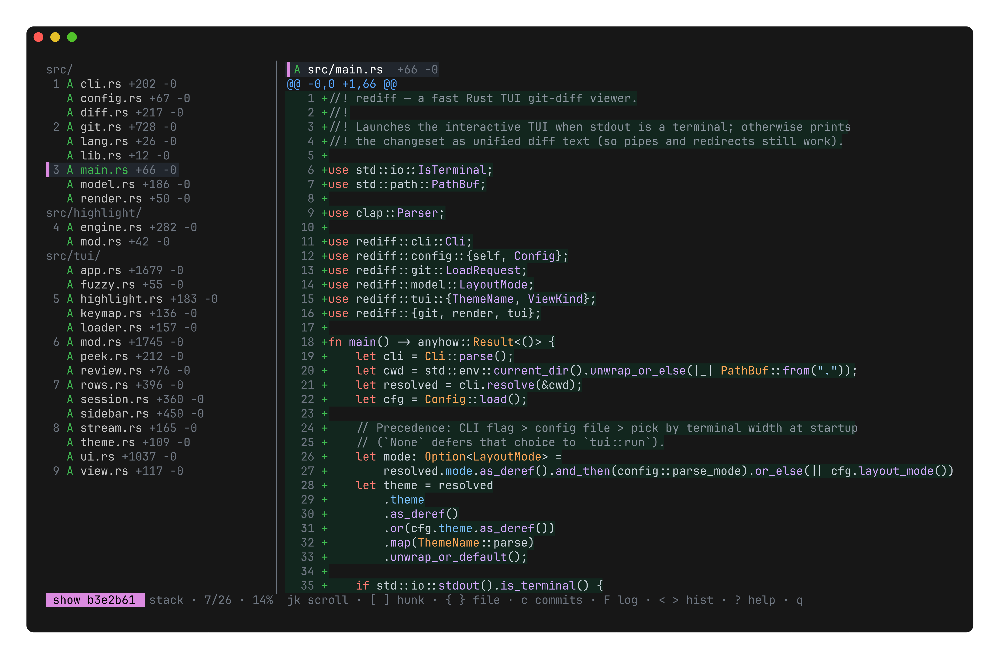

# Rediff

**Re**view **diff** — a fast Rust TUI for reviewing git changes.

<p align="center">
  
</p>

`rediff` opens your working tree, a commit, or a branch range in a terminal
diff viewer built for *reviewing*: a file sidebar, syntax highlighting, a
viewed/unviewed checklist, and keyboard-first navigation. Diffs stream in on a
background pool so the file list appears instantly even on large changesets.

## Features

- **Review workflow** — mark files reviewed (`v`), jump to the next unreviewed
  (`u`), and a live `✓ X/N` count. Finish a directory and it folds itself away.
- **Directory grouping & collapse** — files grouped under their directory; fold
  a directory (`z`) to drop it out of scope in both the sidebar and the diff.
- **Two layouts** — unified (stack) or side-by-side (split), toggled live (`m`).
- **Syntax highlighting** — tree-sitter for Rust, TypeScript/TSX and
  JavaScript/JSX (with intra-line emphasis on the exact changed spans), plus a
  syntect fallback covering Python, Go, C/C++, JSON, TOML, YAML, Markdown, shell,
  HTML and CSS.
- **Navigate history without leaving** — pick a commit (`c`), browse file
  history (`F`), step through a view stack (`<` / `>`), peek a single file (`p`).
- **Streaming load** — the changed-file list is instant; per-file diffs fill in
  behind it, cancellable at any time.
- **Fuzzy file jump**, line wrap, and light/dark themes.

## Install

**Homebrew** (macOS / Linux):

```sh
brew install kennworx/tap/rediff
```

**Shell installer** (Linux / macOS — downloads the right prebuilt binary):

```sh
curl --proto '=https' --tlsv1.2 -LsSf \
  https://github.com/kennworx/rediff/releases/latest/download/rediff-installer.sh | sh
```

**Prebuilt binary via `cargo binstall`** (no compile):

```sh
cargo binstall --git https://github.com/kennworx/rediff rediff
```

**Manual** — download an archive for your platform from the
[latest release](https://github.com/kennworx/rediff/releases/latest), verify it
against the published `.sha256`, and extract the `rediff` binary onto your `PATH`.

Prebuilt binaries are published for Linux (x86_64 gnu + musl, aarch64), macOS
(Intel + Apple Silicon), and Windows (x86_64).

**From source** (requires a Rust toolchain; builds for any target):

```sh
cargo install --git https://github.com/kennworx/rediff
```

## Usage

```sh
rediff                       # review the working tree (untracked included)
rediff diff --staged         # review staged changes (HEAD vs index)
rediff diff --from main      # working tree compared against another ref
rediff diff old..new         # a commit range
rediff show [ref]            # the changes a commit introduced (default HEAD)
rediff review [sha]          # review a commit with viewed-tracking
rediff review --from <base>  # review base..target as one net diff
```

Common flags: `-C/--repo <dir>` to open another repository, `--mode
split|stack`, `--theme dark|light`, and trailing path filters (e.g.
`rediff show HEAD~1 src/`).

### Lazygit integration

**Inline diffs** — `rediff pager` reads git's diff on stdin and renders it with
rediff's theme and highlighting, non-interactively. It post-processes git's diff
rather than replacing it, so lazygit's per-file hunk staging is unaffected:

```yaml
git:
  pagers:
    - pager: rediff pager
```

**Full review on a keypress** — open the interactive TUI as a subprocess. This is
also how you see untracked files, which git's inline diff omits:

```yaml
customCommands:
  - key: <c-g>
    context: files
    command: rediff diff
    output: terminal
  - key: <c-g>
    context: commits
    command: rediff show {{.SelectedCommit.Hash}}
    output: terminal
  - key: <c-g>
    context: subCommits
    command: rediff show {{.SelectedCommit.Hash}}
    output: terminal
  - key: <c-g>
    context: reflogCommits
    command: rediff show {{.SelectedCommit.Hash}}
    output: terminal
  - key: <c-g>
    context: localBranches
    command: rediff diff --from {{.SelectedLocalBranch.Name}}
    output: terminal
```

Tip: set `promptToReturnFromSubprocess: false` so there's no pause when rediff exits.

Alternatively, `rediff external` works as a `GIT_EXTERNAL_DIFF` driver
(`externalDiffCommand: rediff external`, or in a plain terminal via
`GIT_EXTERNAL_DIFF`) — it diffs whole files for full-context highlighting, at the
cost of being invoked once per file.

## Configuration

`rediff` reads `~/.config/rediff/config.toml` for defaults (e.g. layout mode and theme);
CLI flags override it. Missing or partial configs fall back to built-in defaults.

## License

MIT — see [LICENSE](LICENSE).
